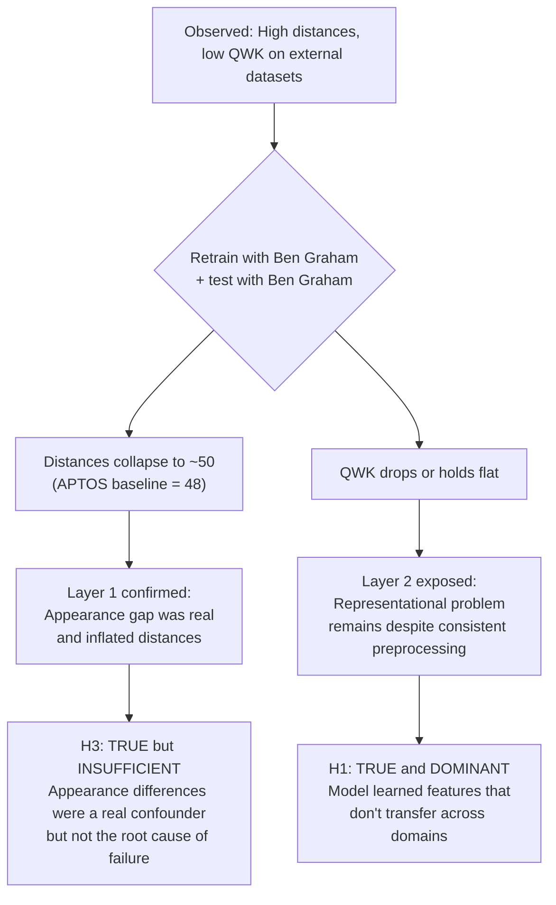
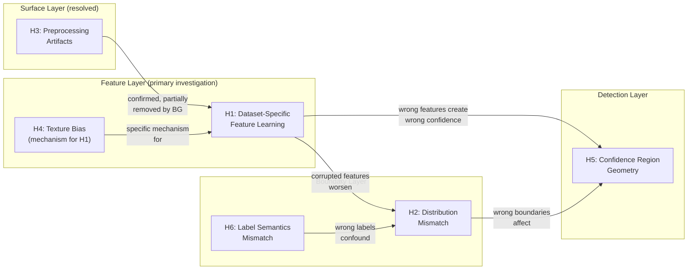

# Ben Graham Preprocessing Analysis & Hypothesis Testing

## What Was Done

The APTOS model (EfficientNet-B0, WCE + augmentation + MC Dropout) was **retrained from scratch with Ben Graham preprocessing** (radius-based cropping + Gaussian blur subtraction for illumination normalization) applied to the APTOS training set. That retrained model was then tested on five external datasets — IDRiD, Messidor (G1/G2/G3), DDR, and EyePACS — also with Ben Graham applied at test time.

Preprocessing was **consistent** between training and testing: both APTOS training images and external test images went through the same Ben Graham pipeline. This is critical — applying Ben Graham at test time only (without retraining) produced catastrophic performance collapse, so the model needed to learn features compatible with the BG appearance profile.

> [!NOTE]
> The "no BG" baseline refers to the original model trained and tested without Ben Graham. The "BG" results use a separately trained model where both train and test use BG. This is a comparison of two complete pipelines, not a test-time-only intervention.

---

## Raw Results

### Comparative Table — Before vs After Ben Graham

| Dataset | Distance (no BG) | Distance (BG) | Δ Distance | QWK (no BG) | QWK (BG) | Δ QWK |
|---------|:-:|:-:|:-:|:-:|:-:|:-:|
| APTOS val (baseline) | 48.2 | 48.1 | — | 0.87 | 0.86 | -0.01 |
| IDRiD | 103.3 | 58.2 | **-45.1** | 0.62 | 0.62 | 0.00 |
| Messidor G1 | 92.8 | 50.6 | **-42.2** | 0.49 | 0.32 | **-0.17** |
| Messidor G2 | 92.7 | 50.5 | **-42.2** | 0.42 | 0.22 | **-0.20** |
| Messidor G3 | 92.9 | 53.3 | **-39.6** | 0.37 | 0.34 | **-0.03** |
| DDR | 100.6 | 53.5 | **-47.1** | 0.54 | 0.41 | **-0.13** |
| EyePACS | 106.6 | 55.2 | **-51.4** | 0.38 | 0.26 | **-0.12** |

> [!IMPORTANT]
> Distances collapsed to near APTOS baseline across all datasets (~50–55 vs 48). QWK either held (IDRiD) or dropped (Messidor, DDR, EyePACS). EyePACS had the largest absolute distance reduction (-51.4) yet the worst post-BG QWK (0.26) — the parent-child relationship doesn't save it. These two facts together are the foundation of the entire analysis.

### Uncertainty & Safety Metrics

| Dataset | Uncertain Fraction (no BG) | Uncertain Fraction (BG) | Certain+Wrong (no BG) | Certain+Wrong (BG) |
|---------|:-:|:-:|:-:|:-:|
| APTOS val | 0.20 | 0.27 | 79 (13%) | 91 (12%) |
| IDRiD | 0.55 | 0.77 | 23 (22%) | 5 (5%) |
| Messidor G1 | 0.32 | 0.28 | 125 (31%) | 147 (37%) |
| Messidor G2 | 0.22 | 0.13 | 144 (36%) | 168 (42%) |
| Messidor G3 | 0.21 | 0.23 | 119 (30%) | 119 (30%) |
| DDR | 0.30 | 0.18 | 2731 (32%) | 3864 (31%) |
| EyePACS | 0.21 | 0.14 | 5722 (21%) | 6861 (20%) |

> [!WARNING]
> IDRiD improved dramatically — uncertainty rose to 0.77 and Certain+Wrong dropped from 23 to 5. But Messidor, DDR, and EyePACS all got worse — uncertainty dropped and dangerous failures increased. EyePACS has the highest absolute Certain+Wrong count in the entire evaluation (6861) despite being APTOS's parent dataset. Ben Graham helps the model be honest about IDRiD but makes it more confidently wrong on everything else.

---

## What the Confusion Matrices Show

### IDRiD — After Ben Graham
```
[[25  8  0  1  0]   ← Class 0: 25/34, some spread to Class 1
 [ 3  2  0  0  0]   ← Class 1: 2/5, small sample
 [ 7  5 13  7  0]   ← Class 2: 13/32 correct, errors spread adjacently
 [ 2  2  1 11  3]   ← Class 3: 11/19 correct, errors spread
 [ 1  4  1  5  2]]  ← Class 4: 2/13 correct, 5 → Class 3 (adjacent)
```

**Pattern**: No Class 0 collapse. Errors are spread across adjacent classes — the expected pattern for genuine uncertainty rather than confident collapse. This is the **only dataset where BG improved safety behavior**: uncertain fraction jumped from 0.55 to 0.77, Certain+Wrong dropped from 23 to 5. The model became more honest rather than more collapsed.

**Why IDRiD is unique**: Same Indian patient population as APTOS, similar equipment, identical 0-4 label space. BG normalized the appearance and the underlying DR features were close enough to APTOS that the model correctly recognized what it didn't know rather than defaulting to Class 0.

### Messidor G1 — After Ben Graham
```
[[151   0   0   0   0]   ← Class 0: 151/151, absorbed everything
 [ 30   0   0   0   0]   ← Class 1: 0/30 correct, all → Class 0
 [ 65   0   1   4   0]   ← Class 2: 1/70 correct, 65 → Class 0
 [  0   0   0   0   0]   ← Class 3: empty (expected, Messidor has no Severe)
 [ 85   0   2  60   2]]  ← Class 4: 2/149 correct, 85 → Class 0, 60 → Class 3
```

**Pattern**: Near-total collapse into Class 0. Classes 1 and 2 are completely absorbed. **Unique finding**: Class 4 shows a split behavior — 85 cases collapsed to Class 0 but 60 predicted as Class 3 (adjacent). Roughly 40% of Class 4 cases landed in the right neighborhood (severe end of the scale) while 57% collapsed. This suggests two subpopulations within Messidor's Proliferative DR: cases with distinctive enough lesion morphology to survive, and cases absorbed by the BG appearance profile.

### Messidor G2 — After Ben Graham (Worst Result in Entire Evaluation)
```
[[186   0   0   0   0]   ← Class 0: 186/186, total absorption
 [ 71   0   0   0   0]   ← Class 1: 0/71, total collapse
 [ 89   0   0   2   0]   ← Class 2: 0/91, near-total collapse
 [  0   0   0   0   0]   ← Class 3: empty
 [ 36   0   0  16   0]]  ← Class 4: 0/52 correct, 36 → Class 0, only 16 → Class 3
```

**Pattern**: The deepest silent failure in the entire analysis. QWK 0.22, uncertain fraction **0.13** — the lowest in the entire evaluation including APTOS itself. The model is maximally confident while being wrong on nearly everything outside Class 0. Not even the partial Class 4 recovery seen in G1 and G3. Class 0 ECE 0.385 is the highest across all datasets — the model is both overconfident and wrong on its dominant prediction. G2 likely has the most extreme equipment difference from APTOS among the three Messidor groups.

### Messidor G3 — After Ben Graham
```
[[209   0   0   0   0]   ← Class 0: 209/209, total absorption
 [ 52   0   0   0   0]   ← Class 1: 0/52, total collapse
 [ 79   0   0   7   0]   ← Class 2: 0/86, near-total collapse
 [  0   0   0   0   0]   ← Class 3: empty
 [ 29   0   1  23   0]]  ← Class 4: 0/53 correct, 29 → Class 0, 23 → Class 3
```

**Pattern**: Similar to G1 but weaker Class 4 survival — 23 predicted as Class 3 out of 53 total vs 60/149 in G1. **Unique finding**: G3 has the best QWK of the three Messidor groups (0.34 vs 0.32 vs 0.22) and lowest Certain+Wrong (119 vs 147 vs 168) despite similar distances. Inter-hospital variation within Messidor is a real compounding factor on top of the base distribution shift.

### DDR — After Ben Graham
```
[[6232   16    9    2    7]   ← Class 0: 6232/6266, intact
 [ 611    6    2    1   10]   ← Class 1: 6/630, near-total collapse
 [3695  127  302   65  288]   ← Class 2: 302/4477 correct (~7%), 3695 → Class 0
 [  90    7   37   29   73]   ← Class 3: 29/236 correct, spread
 [ 362   28   41   37  445]]  ← Class 4: 445/913 correct (~49%)
```

**Pattern**: **Unique finding**: The bifurcation — Class 4 achieves ~49% accuracy while Class 2 achieves only ~7%. A 7x accuracy gap between the most and least severe non-trivial classes. Class 2 is the primary casualty with 3695/4477 → Class 0, the largest absolute misclassification count of any single class across any dataset. Moderate DR is clinically ambiguous by definition and has the weakest decision boundary. Class 4 survives because Proliferative DR features (neovascularization, large hemorrhages, fibrous tissue) are visually distinctive enough to survive preprocessing changes.

### EyePACS — After Ben Graham
```
[[24538   826   219    48   179]   ← Class 0: 24538/25810, but 1272 spread to other classes
 [ 2335    67    20     8    13]   ← Class 1: 67/2443 correct, 2335 → Class 0
 [ 4554   361   262    60    55]   ← Class 2: 262/5292 correct, 4554 → Class 0
 [  558    68   146    73    28]   ← Class 3: 73/873 correct, spread across classes
 [  321    55    78    36   218]]   ← Class 4: 218/708 correct (~31%)
```

**Pattern**: **Unique finding** — the only dataset without near-total Class 0 collapse. Class 0 still dominates but there's genuine spread: 826 true Class 0 predicted as Class 1, 219 as Class 2. Class 3 shows predictions spread across three classes (558→0, 146→2, 73 correct) — not seen in Messidor at all. The model is making varied wrong predictions rather than defaulting to one bucket.

This qualitatively different failure mode reflects the parent-child relationship. APTOS is curated from EyePACS, so even after BG changes the appearance profile, there's enough residual representational overlap for varied (though still wrong) predictions rather than degenerate collapse. The maximum Mahalanobis distance of 152 is the highest in the BG evaluation — EyePACS contains extreme tail images (poor quality, partial coverage, bad lighting) that land very far from anything the model has seen.

### Key Patterns Across All Datasets

1. **Label compatibility matters**: Datasets using the same 0-4 scale as APTOS (IDRiD, DDR, EyePACS) show partial Class 4 survival. Messidor's grade remapping hurts.
2. **Population proximity matters**: IDRiD (Indian, similar to APTOS) is the only dataset where BG helps. Messidor (European) collapses hardest.
3. **Severity determines survivability**: Across DDR and EyePACS, Class 4 features survive BG better than Class 1/2 features. Distinctive pathology transfers; ambiguous pathology doesn't.
4. **Failure mode depends on overlap**: EyePACS (parent dataset) shows spread failure. Messidor (no relationship) shows collapse failure. The qualitative mode, not just the magnitude, differs.

---

## The Two-Layer Decomposition

The results cleanly separate two independent phenomena:

### Layer 1 — Surface Appearance Shift (H3: Preprocessing Inconsistency)

**What it is**: Different datasets have different illumination profiles, contrast characteristics, color balance, and resolution due to different cameras, clinics, and populations.

**Evidence**: When the model is retrained with Ben Graham and all datasets are preprocessed identically, distances collapse from ~92–103 to ~50–58, converging toward the new APTOS baseline (48). This means the large distances measured in [EXP_011](file:///d:/Image%20Recognition/APTOS/aptos2019-blindness-detection/experiments/EXP_011_MAHALANOBIS_DIST.md) were partially (perhaps mostly) driven by surface-level visual differences, not by differences in DR presentation.

**Status**: **Confirmed and quantified**. The appearance gap was real, large (accounting for ~40–50 distance units), and fixable with consistent preprocessing. H3 is true — appearance differences inflated the distances.

### Layer 2 — Representational/Boundary Shift (H1: Dataset-Specific Feature Learning)

**What it is**: Even when the model is retrained with standardized preprocessing and tested with the same standardized preprocessing, it still fails on external data. The appearance gap is gone — preprocessing is consistent — but the learned representations still don't transfer. Features converge in space but converge **toward the wrong class**.

**Evidence**: QWK dropped or held flat despite near-identical distances. Specifically:
- Images from all datasets now sit at the same distance from the training distribution (~50)
- But Messidor/DDR images are being pulled toward the **Class 0 centroid**, not toward their correct class centroids
- Class 0 dominates the training distribution (1805/3662 = 49.3% of APTOS training)
- "Closer to APTOS" effectively means "closer to what APTOS Class 0 looks like"

**Status**: **Exposed by removing Layer 1**. This is actually stronger evidence than test-time-only preprocessing would provide. The model was trained and tested with the same preprocessing — there is no train/test mismatch to blame. The failure is purely in the representations the model learned, not in any preprocessing inconsistency.



---

## The Primary Hypothesis — H1

### Statement

> The model learns a mixture of **DR-invariant features** (lesion morphology, vessel patterns, hemorrhage characteristics) and **dataset-specific features** (scanner color profiles, illumination gradients, image quality characteristics). The DR-invariant features encode genuine clinical information. The dataset-specific features encode acquisition artifacts that correlate with DR grades only within APTOS.

### Evidence Chain

| Evidence | What It Shows | Strength |
|----------|--------------|----------|
| Distances ~2x baseline for all OOD datasets ([EXP_011](file:///d:/Image%20Recognition/APTOS/aptos2019-blindness-detection/experiments/EXP_011_MAHALANOBIS_DIST.md)) | Feature space encodes something beyond DR grades | Indirect |
| Distance doesn't correlate with QWK (IDRiD highest distance, best QWK) | The shift is in different dimensions for different datasets | Moderate |
| Ben Graham collapses distances but not QWK | Appearance component was large but not the classification-relevant component | **Strong** |
| Class 0 collapse pattern after Ben Graham (Messidor, DDR) | Convergence is toward majority class, not toward correct class | **Strong** |
| EyePACS spread failure — varied wrong predictions, not collapse | Parent-child overlap produces confused model rather than degenerate one — features partially transfer but to wrong classes | **Strong** |
| IDRiD uncertainty rises to 0.77 with BG, Certain+Wrong drops to 5 | Removing appearance reveals honest uncertainty — previous results were "accidentally correct" | Moderate |
| DDR Class 4 partially survives (49%) but Class 1/2 collapses | Distinctive DR features transfer, ambiguous ones don't — consistent with mixed representations | Moderate |
| Messidor G2 is maximally confident (0.13 uncertain) while being maximally wrong (QWK 0.22) | Deepest silent failure — H1 features + H5 confidence geometry compound | **Strong** |
| EyePACS max distance 152 (highest in evaluation) | Extreme tail images exist even in parent dataset — heterogeneity survives BG normalization | Moderate |

### What H1 Doesn't Explain

- **Why IDRiD is immune to the QWK drop** with Ben Graham. If the model learned APTOS-specific features, IDRiD should also suffer. The fact that it doesn't suggests IDRiD's DR features overlap with APTOS's more than Messidor's, DDR's, or even EyePACS's — possibly because IDRiD is Indian population with similar equipment.
- **Why EyePACS shows spread failure instead of collapse failure**. If the features are dataset-specific, EyePACS should collapse like Messidor. The parent-child relationship provides partial representational overlap that softens the failure mode — but H1 doesn't predict this qualitative difference, only the fact of failure.
- **The specific mechanism** by which dataset-specific features get entangled with DR features. Is it texture bias? Color channel correlations? ImageNet pretraining inductive bias? H1 says "the model learned wrong features" but not *which* wrong features or *why*.
- **The inter-hospital variation within Messidor** (G2 dramatically worse than G1/G3). H1 predicts uniform failure for a given dataset, but the per-group variation suggests scanner-specific feature entanglement at a finer granularity than "dataset."

---

## Competing Hypotheses

Five alternative explanations that could produce the same observed pattern. Each needs to be ruled out or integrated before H1 can be considered confirmed.

### H2 — Severity Distribution Mismatch (Decision Boundary Problem)

**Claim**: The model's decision boundaries are optimized for APTOS's class prior (49% Class 0, 20% Class 1, 27% Class 2, 2.6% Class 3, 1.6% Class 4). When the test distribution has a different class balance, the boundaries are in the wrong place. The model isn't learning wrong features — it's using the right features with wrong thresholds.

**Why it fits the data**: 
- Class 0 collapse after Ben Graham is exactly what prior mismatch predicts — the model's decision threshold is set for 49% Class 0, so borderline cases are pushed toward the majority class
- Messidor has a very different class distribution (lots of Class 4 via grade 3 mapping, no Class 3)
- DDR's Class 1/2 collapse while Class 4 holds could be threshold-related — severe cases exceed the threshold even with miscalibrated priors

**How it differs from H1**: H1 says the features themselves are wrong. H2 says the features are fine but the decision boundaries are calibrated for the wrong population. Fix is different — H2 would be fixed by threshold adjustment or prior correction, not domain adaptation.

**Key test**: If you adjust prediction thresholds post-hoc (e.g., apply a different class prior or use per-class threshold tuning on a small Messidor validation set), does QWK improve significantly? If yes, H2 is dominant. If the confusion matrix pattern doesn't change much, the problem is in the features, not the boundaries.

---

### H3 — Preprocessing Pipeline Artifacts (Already Resolved)

**Claim**: The model depends on specific preprocessing artifacts from the APTOS pipeline — green channel enhancement, specific resize interpolation, contrast normalization. The "dataset-specific features" in H1 are actually **preprocessing-specific features**.

**Status**: **Effectively resolved** by the Ben Graham experiment. The model was retrained with Ben Graham and tested with Ben Graham — preprocessing is consistent between train and test. Despite this consistency, QWK still dropped on external datasets. This rules out preprocessing mismatch as an explanation. The model saw Ben Graham-normalized images during training and sees Ben Graham-normalized images during testing — and still fails.

**Remaining question**: Would a *different* standardized preprocessing (e.g., CLAHE) produce a different outcome? The Ben Graham result shows that appearance normalization alone doesn't fix the failure, but it's possible that BG specifically introduces artifacts that hurt. Testing with CLAHE would confirm whether the result is preprocessing-method-specific or general.

---

### H4 — Texture Bias from ImageNet Pretraining

**Claim**: EfficientNet-B0 pretrained on ImageNet has a well-documented texture bias — it prefers texture features over shape features. DR classification should rely on shape (vessel branching, hemorrhage morphology, microaneurysm patterns) but the model may be using texture (background grain, illumination texture, noise patterns) which varies across scanners.

**Why it fits the data**:
- Different scanners produce different textures even for the same pathology
- Ben Graham changes the texture profile of images (Gaussian blur subtraction smooths local texture)
- After Ben Graham, images have a more uniform texture → model falls back to its strongest texture signal, which is APTOS Class 0's texture profile

**How it differs from H1**: H4 is a specific mechanistic explanation for *why* the model learns dataset-specific features — it's the ImageNet-induced texture bias. H1 is the broader claim, H4 is one possible mechanism.

**Key test**: GradCAM activation maps. If the model attends to background regions, image borders, and smooth texture areas (texture features) rather than lesion regions (shape features), H4 is supported. Compare GradCAM on APTOS Class 2 correct predictions vs Messidor Class 2 failures — if the model looks at different regions, the features it uses are dataset-dependent.

---

### H5 — Confidence Region Geometry (Uncertainty Failure Mechanism)

**Claim**: The uncertainty failure (low uncertain fraction despite high error rate) isn't about what features the model learned — it's about the geometry of the confidence regions. Class 0 has 49% of training data, creating a large, well-sampled region in feature space with low dropout variance everywhere inside it. When OOD images land in this region, they inherit the low variance → appear confident → aren't flagged.

**Why it fits the data**:
- Class 0 dominant in training → large confidence region → low MC variance everywhere in that region
- OOD images converge toward Class 0 → land deep inside the region → dropout can't distinguish them from genuine Class 0
- IDRiD is different because its shift places images near decision boundaries (Class 0 ↔ Class 1), where dropout variance is naturally higher

**How it differs from H1**: H5 explains the uncertainty failure without requiring wrong features. The features could be correct but the confidence geometry is a byproduct of class imbalance, not feature quality. The fix would be different — recalibrate uncertainty thresholds or use a different OOD detection method (e.g., energy-based) rather than fixing the features.

**Key test**: Compute per-class MC dropout variance. If Class 0 has uniformly low variance (even for misclassified OOD images), while Classes 3/4 have higher variance, the geometry hypothesis is supported. This would explain the uncertainty failure as a separate problem from the feature problem.

---

### H6 — Label Semantics Mismatch (Messidor-Specific)

**Claim**: Messidor's grading scheme ({0, 1, 2, 3} → mapped to APTOS {0, 1, 2, 4}) doesn't capture the same clinical boundaries as APTOS. What Messidor calls "grade 2" may correspond to a different clinical presentation than what APTOS calls "Moderate DR." The model isn't failing because of wrong features — it's failing because the labels don't mean the same thing across datasets.

**Why it fits the data**:
- Messidor has the worst QWK across all datasets
- Messidor grade 3 → APTOS Class 4 mapping is particularly suspect — Messidor's grade 3 ("risk of macular edema") is clinically different from APTOS's Class 4 ("Proliferative DR")
- DDR uses the same 0-4 scale as APTOS and partially transfers → label compatibility matters
- IDRiD also uses the same 0-4 scale and transfers best

**How it differs from H1**: H1 says the model's internal representations are wrong. H6 says the model's representations might be fine for what it learned, but the external labels don't correspond to the same clinical reality. Fix is different — relabel or re-grade, not retrain the features.

**Key test**: Have a clinician independently re-grade a subset of Messidor images using APTOS criteria. If re-grading changes the label distribution significantly and QWK improves after re-grading, H6 is a major contributor. This is expensive but would cleanly isolate label semantics from feature quality.

---

## Hypothesis Interaction Map

These hypotheses are **not mutually exclusive**. The observed failure is likely a combination of multiple factors, each contributing different amounts:



> [!NOTE]
> The most likely scenario: H1 is the dominant explanation, H4 provides the mechanism, H2 amplifies the damage, H6 contributes specifically for Messidor, and H5 explains why the safety system fails to catch it. Ben Graham resolved H3 as a confounder.

---

## Testing Plan — Ordered by Cost and Discriminative Power

### Test 1: Per-Class Mahalanobis Distance ⏱️ ~1 hour

**What**: Compute distance from each test image to each of the 5 class-specific centroids (computed from APTOS training data), not just the global centroid. Already have infrastructure from [EXP_011](file:///d:/Image%20Recognition/APTOS/aptos2019-blindness-detection/experiments/EXP_011_MAHALANOBIS_DIST.md).

**Discriminates**: H1 vs H2
- **H1 predicts**: Messidor Class 4 images are closest to the APTOS **Class 0** centroid (features shifted to wrong region). DDR Class 2 images are also closest to Class 0 centroid.
- **H2 predicts**: Messidor Class 4 images are closest to the APTOS **Class 4** centroid (features are correct, boundary is in the wrong place). The model just needs a lower threshold to trigger Class 4.

**Specific output**: For each misclassified image, report its distance to all 5 class centroids. If the closest centroid matches the predicted (wrong) class rather than the true class, features have genuinely shifted. If the closest centroid matches the true class but the model still predicts wrong, it's a boundary problem.

---

### Test 2: UMAP/PCA Feature Visualization ⏱️ ~2 hours

**What**: Extract 1280-d features for APTOS val + IDRiD + Messidor + DDR + EyePACS (with and without Ben Graham). Run UMAP. Create two plots:
1. Colored by **dataset source** (APTOS, IDRiD, Messidor, DDR, EyePACS)
2. Colored by **DR grade** (0, 1, 2, 3, 4)

**Discriminates**: H1 (globally)
- **H1 predicts**: Dataset-source coloring shows tight, separated clusters. Grade coloring shows overlap within clusters. After Ben Graham, clusters merge but grade structure within the merged cluster is lost — everything converges toward Class 0 region.
- **If H1 is false**: Grade coloring shows clear separation regardless of dataset. Dataset clusters may exist but grade boundaries survive within them.
- **EyePACS-specific prediction**: EyePACS images should show more overlap with APTOS than Messidor does (parent-child relationship), explaining the spread failure vs collapse failure distinction.

**Specific falsifiable prediction from H1**: Messidor Class 4 images should cluster near APTOS Class 0 images after Ben Graham. EyePACS Class 4 should be more dispersed — some near Class 0, some near correct region.

---

### Test 3: Post-Hoc Threshold Adjustment ⏱️ ~1 hour

**What**: After Ben Graham, instead of argmax prediction, apply adjusted class priors or per-class thresholds. Sweep threshold values and measure QWK.

**Discriminates**: H1 vs H2
- **H2 predicts**: Threshold adjustment significantly improves QWK (e.g., Messidor G1 from 0.32 → 0.45+). The features are in the right place, just the decision boundary needs moving.
- **H1 predicts**: Threshold adjustment provides marginal improvement at best. The features are genuinely in the wrong region — no amount of boundary shifting fixes "Class 4 features sitting in the Class 0 zone."

---

### Test 4: GradCAM Attention Maps ⏱️ ~3 hours

**What**: Run GradCAM on matched image sets:
- 15 APTOS Class 2 images correctly predicted as Class 2
- 15 Messidor Class 2 images incorrectly predicted as Class 0
- 15 DDR Class 4 images correctly predicted as Class 4
- 15 DDR Class 4 images incorrectly predicted as Class 0

**Discriminates**: H1 + H4
- **H1/H4 predicts**: APTOS correct predictions activate on lesion regions (microaneurysms, hemorrhages, exudates). Messidor failures activate on background, image borders, or illumination artifacts. The model is literally looking at different things.
- **If H1 is false**: Activation regions are similar across datasets — the model attends to the same clinical features but the features don't separate classes cleanly (supporting H2 instead).

**This is the most visually compelling evidence** for a report or presentation.

---

### Test 5: CLAHE Preprocessing Comparison ⏱️ ~2 hours

**What**: Retrain the model with CLAHE (Contrast Limited Adaptive Histogram Equalization) instead of Ben Graham. Test on external datasets with CLAHE applied. Compare distances and QWK against the Ben Graham pipeline.

**Discriminates**: H3 residual effects — is the result specific to Ben Graham's normalization or general to any appearance standardization?
- If CLAHE produces different distance/QWK patterns than Ben Graham, the specific preprocessing method matters
- If CLAHE produces similar patterns, the effect is robust to preprocessing choice — confirming the Layer 1/Layer 2 decomposition holds generally

---

### Test 6: Per-Class MC Dropout Variance ⏱️ ~1 hour

**What**: Compute mean MC dropout variance separately for each predicted class. Focus on Messidor Class 4 images predicted as Class 0.

**Discriminates**: H5
- **H5 predicts**: Misclassified images predicted as Class 0 have uniformly low MC variance (deep inside the confidence region). Correctly classified Class 4 images have higher MC variance (near boundaries).
- **If H5 is false**: MC variance is similar across correctly and incorrectly classified images — the uncertainty failure has a different cause.

---

## Recommended Priority Order

| Priority | Test | Time | What It Rules Out | What It Confirms |
|:--------:|------|:----:|:-:|:-:|
| 1 | Per-class Mahalanobis | ~1h | H2 vs H1 | Feature shift direction |
| 2 | UMAP visualization | ~2h | Nothing ruled out, but provides direct visual evidence | H1 cluster structure |
| 3 | Threshold adjustment | ~1h | H2 | If features are rescuable |
| 4 | GradCAM | ~3h | — | H1 + H4 mechanism |
| 5 | CLAHE comparison | ~2h | H3 residuals | Preprocessing robustness |
| 6 | Per-class MC variance | ~1h | H5 | Uncertainty failure mechanism |

> [!TIP]
> Tests 1 and 3 together take ~2 hours and cleanly separate H1 from H2. If per-class Mahalanobis shows Class 4 images nearest to Class 0 centroid **and** threshold adjustment doesn't fix QWK, H1 is confirmed and H2 is ruled out as the primary explanation. This is the highest-value pair of experiments.

---

## What This Means for DANN

Regardless of which hypothesis dominates, the results strengthen the case for domain adaptation:

- **If H1 dominates** → DANN directly addresses it by penalizing dataset-specific features in the encoder. The surviving features after DANN would be DR-invariant by construction.
- **If H2 dominates** → DANN still helps because domain-invariant features produce more consistent decision boundaries across populations. But threshold calibration on the target domain would also be needed.
- **If H4 dominates** → DANN forces the encoder away from texture features (which are scanner-specific) toward shape features (which are DR-invariant). This is exactly the debiasing DANN was designed for.
- **If H5 dominates** → DANN doesn't directly fix the confidence geometry, but by cleaning up the feature space, it would make existing uncertainty methods (MC dropout, Mahalanobis) more reliable.
- **If H6 dominates** → DANN cannot fix label semantics. This would need to be addressed separately through label harmonization before training.

The EyePACS result adds a critical nuance: the spread failure mode (varied wrong predictions) vs the collapse failure mode (everything → Class 0) suggests DANN may need to handle these differently. For Messidor-like collapse, DANN needs to create entirely new representational structure. For EyePACS-like spread, DANN needs to sharpen existing but blurry class boundaries. The parent-child relationship means EyePACS is the most realistic deployment scenario — and the one where DANN has the best chance of working because partial feature overlap already exists.

The Ben Graham experiment has effectively removed H3 as a confounder and exposed the deeper problem. Because the model was retrained with consistent preprocessing, there is no train/test mismatch to blame — the failure is purely representational. The path forward is: **run Tests 1–3 to identify the dominant remaining hypothesis, then proceed to DANN with a clearer understanding of what it needs to fix.**
