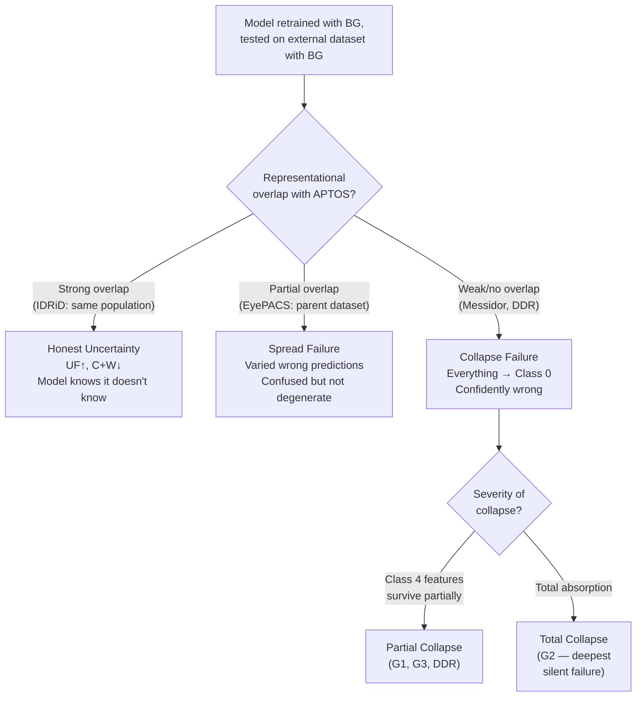

# Ben Graham Per-Dataset Forensic Analysis

This document catalogs the **unique failure signature** of each dataset under Ben Graham preprocessing. While [ben_graham_hypothesis_analysis.md](file:///d:/Image%20Recognition/APTOS/aptos2019-blindness-detection/experiments/ben_graham_hypothesis_analysis.md) focuses on hypothesis testing, this document focuses on the **per-dataset forensics** — what went specifically wrong where, and why.

> [!NOTE]
> All results use the model retrained with Ben Graham on APTOS and tested with Ben Graham on each external dataset. The "no BG" baseline refers to the original model without Ben Graham. Full raw outputs are in [ben graham.md](file:///d:/Image%20Recognition/APTOS/aptos2019-blindness-detection/experiments/ben%20graham.md).

---

## Two Failure Modes

The six datasets reveal **two qualitatively distinct failure modes** that the model exhibits under Ben Graham preprocessing:



---

## IDRiD — The Anomaly

| Metric | No BG | With BG | Change |
|--------|:-----:|:-------:|:------:|
| Distance | 103.3 | 58.2 | -45.1 |
| QWK | 0.62 | 0.62 | 0.00 |
| Uncertain Fraction | 0.55 | 0.77 | **+0.22** |
| Certain+Wrong | 23 | 5 | **-18** |

```
[[25  8  0  1  0]
 [ 3  2  0  0  0]
 [ 7  5 13  7  0]
 [ 2  2  1 11  3]
 [ 1  4  1  5  2]]
```

### Unique Finding

IDRiD is the **only dataset where Ben Graham improved safety behavior**. The model became more honest — flagging more predictions as uncertain (0.55 → 0.77) rather than committing wrongly (23 → 5 Certain+Wrong). No Class 0 collapse at all. Errors are spread across adjacent classes, which is the expected pattern for genuine uncertainty rather than confident wrongness.

### Why This Dataset Specifically

Same Indian patient population as APTOS, similar equipment, identical 0-4 label space. Ben Graham normalized the appearance and the underlying DR features were close enough to APTOS that the model correctly recognized it didn't know rather than defaulting to Class 0. IDRiD is the only dataset where the representational overlap was strong enough to survive preprocessing standardization.

### Clinical Implication

This is actually the **ideal failure mode** for a clinical system — when the model is uncertain, it refers to a specialist. A triage system deployed on IDRiD-like populations (Indian, similar equipment to APTOS) would be usable with BG, provided the referral pathway can handle the 77% uncertain rate.

---

## Messidor G1 — Partial Class 4 Recovery, Total Class 1/2 Collapse

| Metric | No BG | With BG | Change |
|--------|:-----:|:-------:|:------:|
| Distance | 92.8 | 50.6 | -42.2 |
| QWK | 0.49 | 0.32 | **-0.17** |
| Uncertain Fraction | 0.32 | 0.28 | -0.04 |
| Certain+Wrong | 125 | 147 | **+22** |

```
[[151   0   0   0   0]
 [ 30   0   0   0   0]
 [ 65   0   1   4   0]
 [  0   0   0   0   0]
 [ 85   0   2  60   2]]
```

### Unique Finding

The **split behavior in Class 4**: 85 cases collapsed to Class 0 but 60 predicted as Class 3. That's not random — Class 3 is adjacent to Class 4. Roughly **40% of Class 4 cases landed in the right neighborhood** (severe end of the scale) while 57% collapsed to Class 0.

Classes 1 and 2 are completely gone — 0/30 and 1/70 correct respectively. These classes have the most ambiguous visual features and the weakest decision regions from training. They collapse first and completely.

### Why This Specific Pattern

The split in Class 4 suggests **two subpopulations** within Messidor's Proliferative DR: cases with distinctive enough lesion morphology to land near the severe/proliferative region, and cases where the appearance after BG is close enough to APTOS Class 0 to get absorbed. The label remapping (Messidor grade 3 → APTOS Class 4) probably contributes — Messidor's grade 3 covers a range of severities that don't all map cleanly to APTOS Proliferative.

---

## Messidor G2 — Deepest Silent Failure in the Entire Evaluation

| Metric | No BG | With BG | Change |
|--------|:-----:|:-------:|:------:|
| Distance | 92.7 | 50.5 | -42.2 |
| QWK | 0.42 | 0.22 | **-0.20** |
| Uncertain Fraction | 0.22 | **0.13** | **-0.09** |
| Certain+Wrong | 144 | 168 | **+24** |

```
[[186   0   0   0   0]
 [ 71   0   0   0   0]
 [ 89   0   0   2   0]
 [  0   0   0   0   0]
 [ 36   0   0  16   0]]
```

### Unique Finding

Class 4 has **zero correct predictions** and only 16 predicted as Class 3. Everything else collapsed to Class 0. Not even the partial Class 4 recovery seen in G1 and G3. And the model is **maximally confident while doing this** — margin 0.80, uncertain fraction **0.13** (the lowest in the entire evaluation including APTOS itself).

Class 0 ECE is **0.385** — the highest across all datasets and groups. The model is both overconfident and wrong on its dominant prediction.

> [!CAUTION]
> This is the most dangerous result in the entire evaluation. The combination of QWK 0.22, uncertain fraction 0.13, and 168 Certain+Wrong means the model would confidently tell clinicians that nearly every patient is healthy. In a deployment scenario, this is the failure mode that causes real harm.

### Why G2 Specifically

G2 likely has the **most extreme equipment difference from APTOS** among the three Messidor groups. The scanner profile after Ben Graham pushes everything deepest into the Class 0 confidence region. The inter-hospital variation across G1/G2/G3 compounds on top of the base distribution shift — G2 is the worst hospital site for this model.

---

## Messidor G3 — Best of Three, Still Broken

| Metric | No BG | With BG | Change |
|--------|:-----:|:-------:|:------:|
| Distance | 92.9 | 53.3 | -39.6 |
| QWK | 0.37 | 0.34 | -0.03 |
| Uncertain Fraction | 0.21 | 0.23 | +0.02 |
| Certain+Wrong | 119 | 119 | 0 |

```
[[209   0   0   0   0]
 [ 52   0   0   0   0]
 [ 79   0   0   7   0]
 [  0   0   0   0   0]
 [ 29   0   1  23   0]]
```

### Unique Finding

G3 has the **best QWK of the three Messidor groups** (0.34 vs 0.32 vs 0.22) and the **lowest Certain+Wrong** (119 vs 147 vs 168) despite having similar distances to G1 and G2. Class 4 survival is weaker than G1 — 23 predicted as Class 3 out of 53 total vs 60/149 in G1. Classes 1 and 2 completely gone again.

### What This Tells Us

**Inter-hospital variation within Messidor is real and significant.** G3 equipment is marginally closer to what the model can handle after BG, but the difference is small. The fact that three groups from the same dataset can vary from QWK 0.22 to 0.34 means that "dataset-level" analysis is insufficient — the failure operates at the **scanner/site level**.

---

## DDR — Severity Determines Survivability

| Metric | No BG | With BG | Change |
|--------|:-----:|:-------:|:------:|
| Distance | 100.6 | 53.5 | -47.1 |
| QWK | 0.54 | 0.41 | **-0.13** |
| Uncertain Fraction | 0.30 | 0.18 | **-0.12** |
| Certain+Wrong | 2731 | 3864 | **+1133** |

```
[[6232   16    9    2    7]
 [ 611    6    2    1   10]
 [3695  127  302   65  288]
 [  90    7   37   29   73]
 [ 362   28   41   37  445]]
```

### Unique Finding

The **bifurcation**: Class 4 achieves 445/913 correct (~49%) while Class 2 achieves only 302/4477 correct (~7%). That's a **7x accuracy gap** between the most and least severe non-trivial classes.

Class 2 is the primary casualty — 3695 out of 4477 true Moderate DR cases predicted as Class 0. This is the **largest absolute misclassification count of any single class across any dataset**. Moderate DR is clinically ambiguous by definition — it sits between mild and severe, features overlap with both neighbors, and it had the highest ECE even in original APTOS training.

### Why the Bifurcation

Class 4 survives because Proliferative DR features — neovascularization, large hemorrhages, fibrous tissue — are **visually distinctive** enough to survive preprocessing changes. DDR uses the same 0-4 label space as APTOS so these features were learned correctly during training and partially transfer.

Class 2 has nowhere to go. Moderate DR features are subtle (microaneurysms, small hemorrhages, hard exudates) and their appearance changes more under BG normalization. After BG disrupts the appearance profile, these features fall into the Class 0 attractor basin.

---

## EyePACS — Spread Failure, Not Collapse

| Metric | No BG | With BG | Change |
|--------|:-----:|:-------:|:------:|
| Distance | 106.6 | 55.2 | **-51.4** |
| QWK | 0.38 | 0.26 | **-0.12** |
| Uncertain Fraction | 0.21 | 0.14 | -0.07 |
| Certain+Wrong | 5722 | 6861 | **+1139** |

```
[[24538   826   219    48   179]
 [ 2335    67    20     8    13]
 [ 4554   361   262    60    55]
 [  558    68   146    73    28]
 [  321    55    78    36   218]]
```

### Unique Finding

The **only dataset without near-total Class 0 collapse**. Class 0 still dominates but there's genuine spread — 826 true Class 0 images predicted as Class 1, 219 as Class 2. The model is making **varied wrong predictions** rather than defaulting to one bucket.

Class 3 shows 558 predicted as Class 0, but also 146 as Class 2 and 73 correct. That spread across three classes is not seen in Messidor at all. The model is genuinely uncertain about where things land rather than confidently wrong in one direction.

> [!IMPORTANT]
> The absolute numbers are staggering: 6861 Certain+Wrong is the **highest absolute dangerous failure count** in the entire evaluation. But the failure mode is qualitatively different from Messidor/DDR — it's a confused model, not a collapsed one.

### Why the Spread

The **parent-child relationship**. APTOS is curated from EyePACS. Even after Ben Graham changes the appearance profile, there's enough residual representational overlap that the model's predictions are varied rather than degenerate. The features partially match but don't separate cleanly — producing confusion rather than collapse.

The maximum Mahalanobis distance of **152** is the highest in the BG evaluation. EyePACS has images at the extreme tail of the distribution — raw clinical images with poor quality, partial coverage, bad lighting. Those images land very far from anything the model has seen, even after normalization.

---

## Cross-Dataset Summary

### Failure Mode Classification

| Dataset | Failure Mode | Class 4 Survival | Uncertain Fraction | Danger Level |
|---------|:-----------:|:-----------------:|:------------------:|:------------:|
| IDRiD | **Honest uncertainty** | N/A (adjacent errors) | 0.77 ↑ | Low — safe |
| Messidor G1 | Partial collapse | 40% near-correct | 0.28 | High |
| Messidor G2 | **Total collapse** | Near-zero | **0.13** ↓ | **Critical** |
| Messidor G3 | Partial collapse | 43% near-correct | 0.23 | High |
| DDR | Severity-bifurcated | 49% correct | 0.18 | High |
| EyePACS | **Spread failure** | 31% correct | 0.14 | High (by volume) |

### Factors That Determine Failure Severity

Ranked by observed impact:

| Rank | Factor | Evidence | Most Affected |
|:----:|--------|----------|:-------------:|
| 1 | **Population/equipment overlap with APTOS** | IDRiD (same population) is the only dataset that benefits from BG | All datasets |
| 2 | **Label compatibility** | Same 0-4 scale datasets (IDRiD, DDR, EyePACS) show Class 4 survival; Messidor's remapping hurts | Messidor |
| 3 | **Pathology severity** | Class 4 features (distinctive) survive BG; Class 1/2 features (ambiguous) collapse | DDR, EyePACS |
| 4 | **Parent-child relationship** | EyePACS shows spread failure instead of collapse; partial overlap softens the mode | EyePACS |
| 5 | **Intra-dataset scanner variation** | G1/G2/G3 QWK ranges from 0.22 to 0.34 despite identical label space | Messidor |

### The Distance-Performance Paradox

All datasets converge to similar distances after BG (~50–55 vs APTOS baseline 48), but performance varies wildly:

| Distance (BG) | QWK (BG) | Dataset |
|:-:|:-:|---------|
| 48.1 | 0.86 | APTOS (baseline) |
| 58.2 | 0.62 | IDRiD |
| 55.2 | 0.26 | EyePACS |
| 53.5 | 0.41 | DDR |
| 53.3 | 0.34 | Messidor G3 |
| 50.6 | 0.32 | Messidor G1 |
| 50.5 | 0.22 | Messidor G2 |

> [!WARNING]
> Messidor G2 has the **closest distance** to APTOS baseline (50.5 vs 48.1) and the **worst QWK** (0.22). This is the strongest single data point proving that distance alone cannot predict performance. The problem is not "how far away" but "where exactly in the feature space" the images land.

This paradox is the core evidence for Layer 2 (representational/boundary shift) being independent of Layer 1 (appearance shift). BG successfully resolves Layer 1 but exposes — and sometimes worsens — Layer 2.
